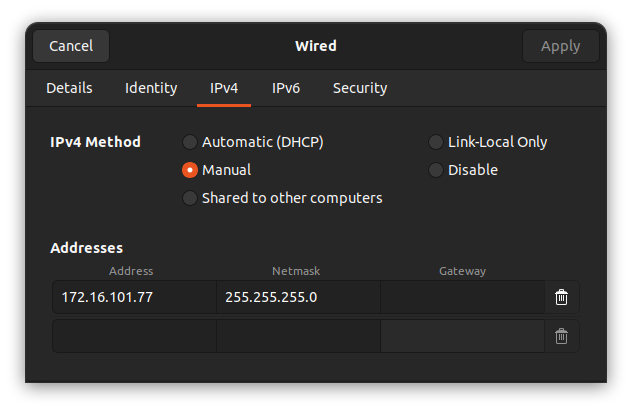

# LiDAR Camera Calibration
ROS2 Setup to perform LiDAR-Camera Calibration for Mobile Robotics Course (CS7.503) at IIITH

- Professor: [K. Madhava Krishna](https://faculty.iiit.ac.in/~mkrishna/)

## Table of contents

- [LiDAR Camera Calibration](#lidar-camera-calibration)
  - [Table of contents](#table-of-contents)
  - [Docker Setup](#docker-setup)
  - [Hardware Setup](#hardware-setup)
  - [Data Collection](#data-collection)
    - [Rosbag Preparation](#rosbag-preparation)
      - [Required Topics in the Rosbag](#required-topics-in-the-rosbag)
      - [Important Notes:](#important-notes)
      - [Sample Dataset](#sample-dataset)
    - [Checkerboard Images Preparation](#checkerboard-images-preparation)
      - [Checklist for Checkerboard Image Preparation](#checklist-for-checkerboard-image-preparation)
      - [Calibration Parameter File](#calibration-parameter-file)
      - [Sample Dataset](#sample-dataset-1)
      - [Additional Notes](#additional-notes)
  - [How to Use](#how-to-use)
    - [References](#references)


## Docker Setup
- To pull latest docker image
    ```bash
    docker pull ghcr.io/soham2560/humble-lidar-cam:latest
    ```
- To start container
    - Open Command Pallete with `Ctrl+Shift+P`
    - Select Option to Rebuild and Reopen Container
    - Use `Build WS` button to build workspace
  
  Note: To access these buttons you may need to enable [VSCode Action Button Extension](https://marketplace.visualstudio.com/items?itemName=seunlanlege.action-buttons) through the Extensions Tab in VSCode, the extension should download automatically on container startup
  
## Hardware Setup
The repository has currently been setup with
- RGB Camera: Realsense D455
  - No Additional Setup is required for this
- 3D LiDAR: Velodyne VLP16s
  - LiDAR IP: 172.16.101.71
  - Host IP: 172.16.101.77
  
  
- RGB Camera(Deprecated): Logitech C270
  - Setup UDEV Rules by running the `c270.sh` script in the `scripts` folder on **HOST**, and not in container
    ```bash
    sudo bash <path to script>/c270.sh
    ```
Our calibration rig is setup as below


## Data Collection

To perform calibration using this repository, two types of data are required:

1. **Rosbags** containing synchronized Camera and LiDAR data for extrinsic calibration.
2. **Checkerboard Images** for intrinsic calibration using [Zhang's Calibration Method](https://ieeexplore.ieee.org/abstract/document/888718).

### Rosbag Preparation

Each rosbag for LiDAR and Camera data must meet the following criteria:

- **Duration**: 30 seconds to 1 minute.
- **Format**: `sqlite3` (`.db3`) format.
- **Setup**: Both the camera and LiDAR must remain stationary at the start of the rosbag recording.
- **Synchronisation**: Both the camera and LiDAR must be time synchronised using `message_filters` or equivalent
- **Minimum Requirement**: At least 3 rosbags are recommended for accurate calibration results.

#### Required Topics in the Rosbag
The following topics must be included in each rosbag:

1. **Camera Info**:
   - **Message Type**: `sensor_msgs/msg/CameraInfo`
   - **Purpose**: Contains the intrinsic parameters of the camera (e.g., focal length, distortion coefficients).

2. **Images**:
   - **Message Type**: `sensor_msgs/msg/Image`
   - **Purpose**: Stores raw image frames from the camera.

3. **PointCloud2**:
   - **Message Type**: `sensor_msgs/msg/PointCloud2`
   - **Purpose**: Provides 3D point cloud data from the LiDAR for spatial alignment and calibration.

#### Important Notes:
- Use static scenes (stationary objects) during recording for better calibration accuracy.
- Ensure that you move the LiDAR around the scene in slow manner to improve reconstruction

Once prepared, place the rosbags in the following directory structure:

```plaintext
lidar_camera_calibration/
├── data/
│   ├── rosbag_data/
│   │   ├── rosbag/
│   │   │   ├── <rosbag_folder_0>/
│   │   │   │   ├── metadata.yaml
│   │   │   │   └── rosbag_0.db3
│   │   │   ├── <rosbag_folder_1>/
│   │   │   │   ├── metadata.yaml
│   │   │   │   └── rosbag_1.db3
│   │   │   └── ...
```
#### Sample Dataset

A sample dataset of LiDAR Camera rosbag for our hardware setup can be found [here](https://drive.google.com/drive/folders/1E2WwuL5QeAQgQKFNNh_OL9cHG9JBBuQd?usp=sharing).

### Checkerboard Images Preparation

Checkerboard images are essential for intrinsic calibration using [Zhang's Calibration Method](https://ieeexplore.ieee.org/abstract/document/888718). These images help compute the intrinsic parameters of the camera, such as focal length and distortion coefficients.


#### Checklist for Checkerboard Image Preparation

- **Quality**:
    - Ensure the entire checkerboard is clearly visible in each image.
    - Capture images from various orientations and angles for better calibration results.
  
- **Checkerboard Specifications**:
    - **Square Size**: Measure the side length of one square in meters (e.g., `0.0835 m`) and ensure it is accurate.
    - **Pattern Dimensions**:
        - Width (number of internal corners along the checkerboard width): `8`
        - Height (number of internal corners along the checkerboard height): `6`

- **Storage**:
    - Store the images directly in the `input_folder` specified in the calibration parameter file.


#### Calibration Parameter File

The calibration configuration is defined in the [zhangs.yaml](lidar_camera_calibration/config/zhangs.yaml) parameter file as follows:

    ```yaml
    zhang_calibration:
      ros__parameters:
        input_folder: "/ros2_ws/src/lidar_camera_calibration/data/checkerboard_images"
        output_file: "/ros2_ws/src/lidar_camera_calibration/data/zhangs_intrinsics.txt"
        square_size: 0.0835
        pattern_width: 8
        pattern_height: 6
    ```

- **Key Points**:
    - Do not modify the folder paths: Images should be placed directly in the `input_folder` (`/ros2_ws/src/lidar_camera_calibration/data/checkerboard_images`).
    - Modify the square size (`square_size`) and pattern dimensions only if your checkerboard differs from the default setup.

- **File Output**:
    - The intrinsic calibration results will be saved in `zhangs_intrinsics.txt` at `/ros2_ws/src/lidar_camera_calibration/data/`.


#### Sample Dataset

A sample dataset of checkerboard images for our hardware setup can be found [here](https://drive.google.com/file/d/1r5_1Ey6SHlaap9jibUEJdrw7PtuXCfdX/view?usp=sharing).

#### Additional Notes
- Use high-resolution images for better calibration results.
- Ensure even lighting conditions to avoid shadows on the checkerboard, which could distort the detected corners.
- Capture at least 20–25 images with varying perspectives to improve the accuracy of Zhang's calibration method.

## How to Use
- Build and Source the Workspace using below commands (in `/ros2_ws` folder)
  ```bash
  colcon build --symlink-install --cmake-args -DCMAKE_CXX_FLAGS='-Wno-unused-parameter -Wno-unused-variable -Wno-sign-compare -Wno-unused-but-set-variable'
  source install/setup.bash
  ```
- Ensure Hardware is setup properly and powered on
- Ensure you have rosbags and images stored as described in [Data Collection](#data-collection) either using your own data or the provided sample data
- Use following command to launch
  ```bash
  ros2 launch lidar_camera_calibration calibration.launch.py
  ```
- A few launch option are available with above command
  - `use_rviz:=True/False` : Launches Rviz along with setup to allow for visualization 
  - `enable_hardware:=True/False` : Launches hardware interfaces for LiDAR and Camera
  - `record:=True/False` : Starts rosbag recording 5 seconds into launch

### References
- Koide, K., et al. "General, Single-shot, Target-less, and Automatic LiDAR-Camera Extrinsic Calibration Toolbox," *ICRA 2023*.
- Koide3's repository for LiDAR-Camera Calibration: [https://github.com/koide3/direct_visual_lidar_calibration](https://github.com/koide3/direct_visual_lidar_calibration).
- Deephome's collection of LiDAR-Camera Calibration resources: [https://github.com/Deephome/Awesome-LiDAR-Camera-Calibration](https://github.com/Deephome/Awesome-LiDAR-Camera-Calibration).


Note: The README's in this repository are inspired by [this](https://github.com/TheProjectsGuy/MR21-CS7.503) and [this](https://github.com/ankitdhall/lidar_camera_calibration)
